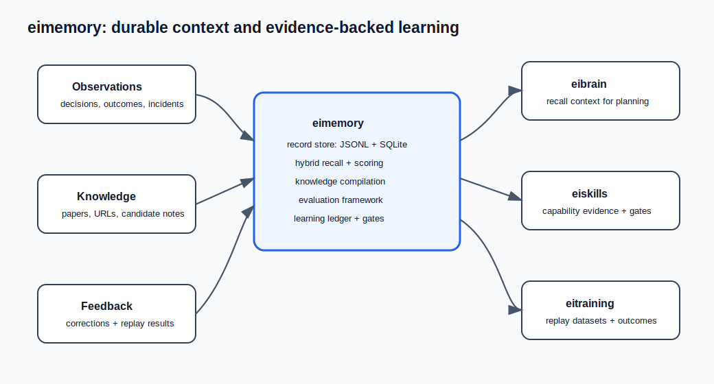

# eimemory

`eimemory` is a local-first memory, knowledge, and evolution runtime for
OpenClaw, eibrain, and long-running AI agents.

It is designed for agents that need durable context across days, weeks, and
projects without turning private memory into a cloud dependency. The system
captures operator decisions, task outcomes, corrections, incidents, knowledge
sources, replay results, and capability evidence, then turns them into
queryable memory and conservative self-improvement signals.

`eimemory` is part of the EI series:

- `eimemory`: memory, knowledge, recall, evaluation, and learning ledger
- `eibrain`: cognition/runtime layer that consumes memory and decides what to do
- `eiskills`: skill registry and capability packaging layer
- `eitraining`: replay, evaluation, and training feedback loop
- `eiprotocol`: shared event and message contracts
- `eihead`: embodied/audio/vision/head runtime integration



## What Problem It Solves

Most agent systems lose the hard parts of experience:

- why a decision was made
- what the user corrected
- which workflow failed
- what evidence made a rule trustworthy
- which memories should be recalled for a specific task
- whether a new capability improved real outcomes or only looked good once

`eimemory` treats those signals as first-class records. It gives an agent a
memory substrate that can store, retrieve, evaluate, and refine operational
knowledge while keeping execution authority outside the memory layer.

## Design Goals

- Local-first: data stays in a local JSONL plus SQLite store by default.
- Memory-only boundary: `eimemory` does not own task execution or orchestration.
- Auditable recall: retrieval results include scoring and quality metadata.
- Quality-aware persistence: low-value or unsafe candidates can be rejected
  before they pollute long-term recall.
- Evidence-backed learning: capability upgrades require observations, replay,
  evaluations, gates, and rollback paths.
- Conservative autonomy: external actions, spending, credentials, and private
  data export remain outside automatic authority.
- Integration-friendly: CLI, Python APIs, OpenClaw hooks, QMD compatibility,
  and eibrain RPC are all supported.

## Memory Boundary

`eimemory` is a memory system. It stores knowledge, recalls knowledge, and refines memory over time.
It does not own execution, task orchestration, or workflow control.

## How It Works

At a high level, `eimemory` has five cooperating surfaces:

1. Record store: appends structured memory records to JSONL and materializes
   searchable state in SQLite.
2. Recall layer: combines lexical, semantic/vector, graph, and quality-aware
   scoring to return task-relevant context.
3. Knowledge layer: ingests sources such as papers, URLs, and candidate notes,
   then extracts claims, entities, relations, pages, and recall views.
4. Evaluation layer: runs deterministic memory, recall, LongMemEval-style,
   actionable-memory, and living-memory checks.
5. Governance layer: turns observations into goals, replay datasets, candidate
   portfolios, capability ledger entries, and bounded rollout decisions.

## Current Capabilities

- Unified record model for memory, incidents, feedback, rules, and replay
- JSONL append log plus SQLite materialized store
- Recall API for OpenClaw and eibrain consumers
- Evolution API for observe, feedback, review, promote, replay, and ROI
- OpenClaw hook shim, tool shim, and plugin manifest
- OpenClaw lifecycle bridge plugin plus `openclaw-hook` CLI bridge
- eibrain SDK, RPC bridge, and HTTP RPC server
- CLI for init, ingest, recall, export, import, and nightly jobs
- Event memory policy layer for task intent, execution path, outcomes, corrections, and policy-first recall
- Nightly judgment evaluation that summarizes outcomes into reusable playbook intent patterns
- Conservative migration scanner/importer for markdown, JSONL, and SQLite sources
- Local vector-assisted hybrid retrieval layer
- Memory quality metadata, capture tiers, and quality-aware hybrid recall
- Lightweight reflection/operator commands for check, log, read, and stats
- Paper-first knowledge memory: source intake, extract, claim/entity/relation records, compiled knowledge pages, recall views, and contradiction-aware refresh signals
- Autonomous learning loop: world signals, self-model, curiosity goals, evidence-backed research, sandbox experiments, gated L2 rollout, capability ledger, regression rollback, and retention compaction
- Compact RPC health endpoints for repeatable service checks without loading daily/research digests

## Use Cases

- Personal or team agents that need long-term preferences and project memory.
- Agent runtime debugging where failures should become reusable lessons.
- Productized agent systems that need recall quality metrics and regression
  gates.
- Knowledge-heavy workflows that need paper/source intake and claim-centered
  recall.
- Multi-component EI deployments where `eibrain`, `eiskills`, and `eitraining`
  need one shared memory and evidence layer.
- Operators who want autonomous improvement signals without allowing the memory
  system to spend money, send external messages, change credentials, or mutate
  production by itself.

## Safety Model

`eimemory` separates memory from authority. The runtime can record observations,
prepare suggestions, generate replay artifacts, and promote low-risk local
assets when gates pass. It does not automatically perform high-risk actions.

Authority tiers:

- `L0`: records, reports, replay cases, and scores.
- `L1`: low-risk local assets such as memory rules, route drafts, playbooks,
  and eval fixtures.
- `L2`: gated rollout through explicit adapters after evidence, eval, health,
  canary, timeout, rollback, audit, and regression checks pass.
- `L3`: external sends, spending, auth/token changes, private data export,
  device actions, irreversible deletion, or privilege expansion. These stay
  blocked by default.

## Quick Start

```bash
python -m pip install -e .
eimemory init
eimemory ingest "Remember concise replies" --title "Concise"
eimemory recall "concise replies"
eimemory recall "compact retrieval" --view page_centered
eimemory quality stats
eimemory reflect check
eimemory reflect log reply-style "Forgot concise style" "Reply with one sentence"
eimemory learn cycle --dry-run
eimemory learn ledger
```

## Autonomous Learning

`eimemory learn cycle` runs the bounded self-improvement loop:

```text
watch -> self-model -> think -> goals -> research -> replay dataset -> portfolio -> eval -> promote -> ledger -> dashboard -> retention
```

The loop is offline-first and deterministic by default. It can learn from local
outcome traces, recall gaps, replay results, reflections, incidents, and enabled
watchers without waiting for a new user correction.

Authority tiers:

- `L0`: records, reports, replay cases, scores.
- `L1`: local low-risk assets such as memory rules, tool-route drafts, playbooks, and eval fixtures.
- `L2`: fully authorized gated rollout after machine gates pass. A target must have a concrete rollout adapter before it can be marked applied; unsupported code/deploy/scheduler targets are blocked instead of being fake-promoted. L2 requires evidence, eval, health, canary, timeout, rollback, audit, and regression gates.
- `L3`: external sends, spending, auth/token changes, private data export, device actions, irreversible deletion, or privilege expansion. These remain blocked.

Useful commands:

```bash
eimemory learn watch --dry-run
eimemory learn watch --apply
eimemory learn cycle --dry-run
eimemory learn cycle --apply --force
eimemory learn loops --limit 5
eimemory learn goals --limit 10
eimemory learn candidates --limit 10
eimemory learn ledger
eimemory learn think --persist
eimemory learn replay-dataset --persist
eimemory learn compact --dry-run
eimemory learn report --persist
eimemory learn dashboard --persist
eimemory learn promote <candidate_id> --apply --eval-json '{"verdict":"pass","scores":{"safety":1,"regression":1},"gate_bundle":{...}}'
```

`code_patch` L2 candidates are automatically promoted into reviewable patch
artifacts when gates pass. They are not applied to production directly; the
artifact is ready for machine review, branch creation, or PR automation.

The 1.0.0 proactive layer adds a short thinking pass between observation and
goal selection. It turns repeated weak signals, long-term objectives, recent
corrections, stale assets, and replay gaps into persisted `thought` records,
then promotes high-value thoughts into learning goals and reviewable candidate
portfolios.

Production schedule examples (all in `deploy/systemd/`):

```bash
cp /dev-project/eimemory/deploy/systemd/eimemory-learn-watch.service ~/.config/systemd/user/
cp /dev-project/eimemory/deploy/systemd/eimemory-learn-watch.timer ~/.config/systemd/user/

cp /dev-project/eimemory/deploy/systemd/eimemory-learn-think.service ~/.config/systemd/user/
cp /dev-project/eimemory/deploy/systemd/eimemory-learn-think.timer ~/.config/systemd/user/

cp /dev-project/eimemory/deploy/systemd/eimemory-learn-dashboard.service ~/.config/systemd/user/
cp /dev-project/eimemory/deploy/systemd/eimemory-learn-dashboard.timer ~/.config/systemd/user/

systemctl --user daemon-reload
systemctl --user enable --now eimemory-learn-watch.timer eimemory-learn-think.timer eimemory-learn-dashboard.timer
```

Nightly autonomous learning is controlled from the scheduler environment. The
production systemd template enables the 1.0.0 loop by default:

```bash
EIMEMORY_AUTONOMOUS_LEARNING_ENABLED=1
EIMEMORY_AUTONOMOUS_LEARNING_APPLY=1
EIMEMORY_AUTONOMOUS_LEARNING_DRY_RUN=0
EIMEMORY_AUTONOMOUS_LEARNING_MAX_GOALS=3
EIMEMORY_AUTONOMOUS_LEARNING_TIMEOUT_SECONDS=900
```

## eibrain RPC Service

Start the eibrain-facing RPC boundary from the deployed runtime environment, not from a source checkout path:

```bash
EIMEMORY_ROOT=/var/lib/eimemory eimemory serve-eibrain-rpc --host 100.66.161.64 --port 8091
```

`eibrain` should connect to the running endpoint, for example `http://honxin:8091/`.
The integration contract is the endpoint address, not the repository location.

Use compact health endpoints for monitoring:

```bash
curl http://honxin:8091/health
curl http://honxin:8091/livez
curl http://honxin:8091/readyz
```

Detailed daily digest payloads live at `/daily-brief` and `/diagnostics`, so
health checks stay fast even when the knowledge store is large.

A production systemd template is available at `deploy/systemd/eimemory-rpc.service`.

## Memory Quality

New memory records carry deterministic quality metadata under `meta.quality`:
`importance`, `confidence`, `freshness`, `reuse_potential`, `salience_score`,
`quality_tier`, and `capture_decision`.

The quality tier is used to keep the long-term store useful:

- `rejected`: not persisted or excluded from recall when present in legacy data
- `candidate`: low-confidence memory that should not dominate recall
- `confirmed`: normal reusable memory
- `core`: high-salience memory that should be favored during recall

Hybrid recall now combines lexical, semantic/vector, graph, and quality signals.
Recall explanations include a `quality_summary` plus per-item scoring details so
operators can see why a memory was selected.
For user-scoped integrations, `user_id=""` records are treated as shared global
memory within the same tenant/agent/workspace, while other users' records remain
isolated.

Quality can be inspected from the CLI:

```bash
eimemory quality stats
```

Nightly jobs include a `memory_quality` report with tier distribution, average
salience, source counts, and memory type counts.

## Memory Evaluation CI

`eimemory eval ci` runs a deterministic benchmark-style memory quality suite.
It reports extraction, update, usage, consistency, temporal, implicit,
hallucination, and efficiency signals. Failed samples can also be emitted as
incidents so autonomous rule evolution has repair evidence instead of waiting
for manual feedback.

```bash
eimemory eval ci examples/evaluation/memory_ci.json --emit-incidents --output .tmp/memory-eval-report.json
```

Use `passed_threshold` as the CI gate. Use `incident_record_ids` to inspect
failures that should become repair evidence or replay datasets.

## Paper Knowledge Memory

Papers enter `eimemory` as source memory before becoming usable knowledge records.
The pipeline stays memory-only: it structures and recalls knowledge for consumers,
but does not control tasks.

```bash
eimemory paper ingest --arxiv-id 2501.12345 --title "Compact Retrieval" --abstract "Compact retrieval improves embodied response quality."
eimemory paper extract --paper-source-id <paper_source_id> --title "Compact Retrieval" --abstract "Compact retrieval improves embodied response quality." --body "Method: compact retrieval."
eimemory paper compile --paper-source-id <paper_source_id>
eimemory recall "compact retrieval" --view claim_centered
eimemory recall "compact retrieval synthesis" --view page_centered
```

External research sources are registered separately from fetched paper content:

```bash
eimemory source add --source-kind url --title "ChatPaper arXiv cs.AI" --uri "https://www.chatpaper.ai/zh/dashboard/arxiv/cs/AI" --tag chatpaper --tag arxiv --tag paper
eimemory source scan --persist
eimemory intake collect --source-kind url --fetch --persist
```

`source scan --persist` records that a source exists and has been scanned.
`intake collect --fetch --persist` fetches external items and persists them as
reviewable `knowledge_candidate` records. Nightly jobs run the conservative
closed loop: collect external sources, persist safe candidates, promote
paper-like candidates into paper knowledge objects, and project only high-value
operational knowledge into runtime memory.

Core records:

- `paper_source`: canonical source identity and provenance
- `paper_extract`: structured text extracted from one source
- `claim_card`: atomic evidence-backed knowledge
- `entity_record` and `relation_record`: graph-shaped context around claims
- `knowledge_page`: compiled paper/topic memory for longer-horizon reuse
- `recall_view`: memory-only output shape for task, research, mixed, contradiction, or freshness use

## OpenClaw QMD Compatibility

`eimemory` can expose a QMD-compatible command surface for OpenClaw's experimental
`memory.backend = "qmd"` path:

```json
{
  "memory": {
    "backend": "qmd",
    "qmd": {
      "command": "eimemory qmd"
    }
  }
}
```

The compatibility layer currently supports:

- `eimemory qmd collection list --json`
- `eimemory qmd collection add <path> --name <name> --mask <pattern>`
- `eimemory qmd collection remove <name>`
- `eimemory qmd update`
- `eimemory qmd embed`
- `eimemory qmd search|query|vsearch <query> --json -n <limit> [-c <collection>]`

Every exported memory write also materializes a markdown record under
`<EIMEMORY_ROOT>/qmd/records/`, so QMD collections can point at a clean markdown
tree instead of indexing `records.jsonl` directly.

## OpenClaw Lifecycle Bridge

`eimemory` also exposes a small stdin/stdout bridge for OpenClaw lifecycle hooks:

```bash
echo '{"agent_id":"main","workspace_id":"repo-x","message":{"role":"user","content":"Remember concise replies"}}' | eimemory openclaw-hook message_received
```

The corresponding OpenClaw bridge assets live in `integrations/openclaw/eimemory-bridge/`
and forward `message_received`, `before_prompt_build`, and `agent_end` into the
local runtime.

The OpenClaw adapter applies memory hygiene before persistence or injection:
low-value chatter, wrapper-only messages, prompt-injection-like inputs, malformed
hook output, and model thinking traces are filtered by default. Explicit
`capture_memory=true` or `captureMemory=true` can still force intentional capture.

## Migration

`eimemory` can screen legacy sources before importing them:

```bash
eimemory migrate scan /path/to/legacy-memory
eimemory migrate import /path/to/legacy-memory --candidate-id md-1
```

Supported sources:

- markdown and plain text files
- JSONL record logs
- SQLite sources with `records` or OpenClaw-style `files/chunks` tables

Only candidates that pass the conservative screen are imported by default.

## Layout

- `eimemory/` package source
- `integrations/openclaw/` plugin metadata
- `examples/standalone/` basic usage example
- `docs/` architecture and platform notes
